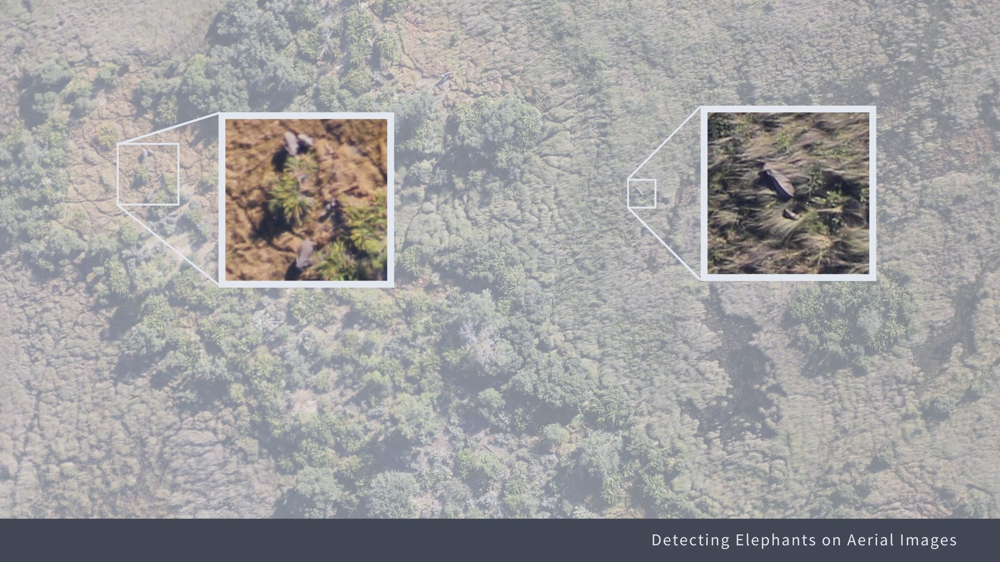
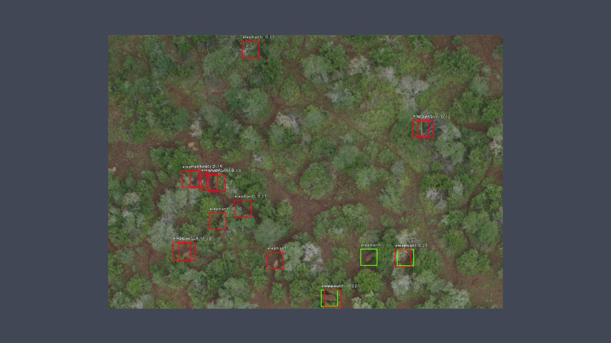
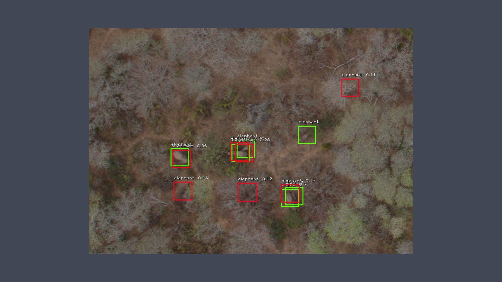
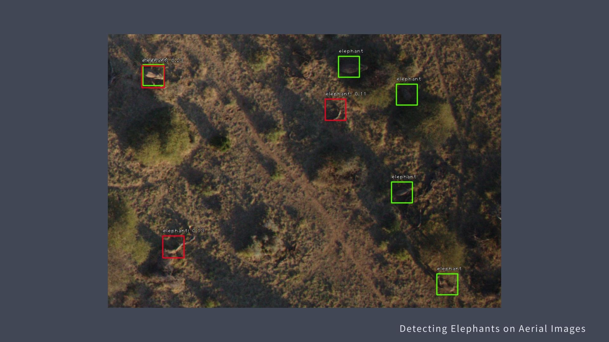

# Elephant Detection
Using Keras-RetinaNet to detect elephants from aerial images 

Flatiron School DC-DS-08262019 Capstone Project

In this project I wanted to explore the realm of computer vision, and jumped straight into the deep pool of object detection. 

## Data

Source:
Naudé, Johannes J., & Joubert, Deon. (2019). The Aerial Elephant Dataset. Zenodo. 
http://doi.org/10.5281/zenodo.3234780

From the paper:
> (A) challenging dataset to enable research on game detection under real-world conditions. The dataset consists of 2101 images containing a total of 15 511 African bush elephants in their natural habitats, imaged with a consistent methodology over a range of background types, resolutions and times-of-day.

## Methods and Libraries 

I used the Keras implementation of RetinaNet by [fizyr](https://github.com/fizyr/keras-retinanet/), which is based on [*Focal Loss for Dense Object Detection* Paper](https://arxiv.org/abs/1708.02002) by Tsung-Yi Lin, Priya Goyal, Ross Girshick, Kaiming He, and Piotr Dollar.

As a supplement, this [anchor optimization tool](https://github.com/martinzlocha/anchor-optimization/) by @martinzlocha is also used to make sure the right configuration (anchor ratios and scales) is implemented. This is especially important due to the (extremely) small object sizes to be detected.  

This is a single class object detection task (class 0: elephant)

## Work Environment

- Google Cloud Platform instance with Nvidia Tesla T4 GPU
- CUDA 10
- Tensorflow 1.15
- Keras 2.3.1

## Project Steps and Results 

- Create bounding box around dataset's annotation (mid point pixel x,y coordinate)
- Divide test set into test and validation
- Train dataset without augmentation using pre-trained coco model (downloaded [here](https://github.com/fizyr/keras-retinanet/releases/download/0.5.1/resnet50_coco_best_v2.1.0.h5)), continued training for 60 epochs
- Train dataset with visual effect augmentation using pre-trained coco model, continued training for 38 epochs

Model performance at this point: 
- Recall    : 42.9%
- Precision : 12.3%
- mAP       : 19.5%

## Discussion and Future Work
The model resulted in a lot of false positives (about 7 false positives for every true positive), and it does a better job (higher recall, precision) on some landscapes than others. To improve performance, the following steps can be taken: 
- Clip / divide images into smaller ones to help with data imbalance and speed up training
- Train separate models for different landscape
- Train model to include objects often mis-identified as elephants 

